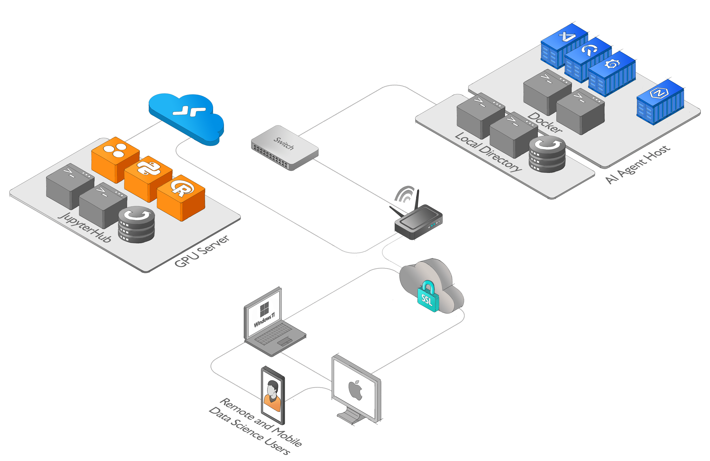

# Raspberry Pi AI Agent Host Tutorial

In this tutorial, you will learn how to set up and use the Raspberry Pi AI Agent Host, a powerful environment for AI development on a Raspberry Pi 4 with 8GB RAM. This tutorial covers the key features, installation steps, and usage guidelines for the AI Agent Host. Let's get started!

## Table of Contents

1. [Introduction](#introduction)
2. [Features](#features)
3. [AI Agent Host Setup](#ai-agent-host-setup)
   1. [Prerequisites](#prerequisites)
   2. [Installation](#installation)
4. [Usage](#usage)
5. [Frequently Asked Questions](#frequently-asked-questions)
6. [Architecture Diagram](#architecture-diagram)
7. [References](#references)

## Introduction

The AI Agent Host is an innovative environment for running AI applications on a Raspberry Pi. It's designed for AI development and is modular, making it highly customizable for various projects. The AI Agent Host can work with live data from APIs and Raspberry Pi sensors, making it ideal for real-time data analysis and decision-making.

## Features

The AI Agent Host offers several key features that make it a powerful tool for AI development on a Raspberry Pi 4 with 8GB RAM:

1. **Modular Environment**: You can add or remove components based on project requirements, making it highly customizable.

2. **Live Data Interaction**: The AI Agent Host can work with live data from APIs and Raspberry Pi sensors.

3. **Lightweight Services**: It includes lightweight services like QuestDB and Grafana, optimized for Raspberry Pi's limited resources.

4. **Remote Development**: You can connect to a remote JupyterHub for GPU server processing.

5. **Data Handling and Visualization**: QuestDB and Grafana are included for efficient data handling and visualization.

6. **Optimized for DietPi**: The AI Agent Host is compatible with DietPi, a lightweight OS for single-board computers.

7. **Community Support**: Active communities provide support and resources for AI development projects.

## AI Agent Host Setup

### Prerequisites

Before setting up the AI Agent Host, ensure you have the following prerequisites:

- A Raspberry Pi 4 with 8GB RAM.
- Docker installed on your Raspberry Pi.

### Installation

Follow these steps to set up the AI Agent Host on your Raspberry Pi:

1. Open a terminal on your Raspberry Pi.

2. Run the following command to install necessary software components:

   ```shell
   dietpi-software
   ```

   Select the following software items to install:

   - I2C
   - Prometheus Node Exporter
   - Docker Compose
   - Docker
   - Git

3. Reboot your Raspberry Pi:

   ```shell
   sudo shutdown -r now
   ```

4. Clone the AI Agent Host repository and navigate to the docker directory:

   ```shell
   umask 0002
   git clone https://github.com/quantiota/Raspberry-Pi-AI-Agent-Host.git
   umask 0022
   cd Raspberry-Pi-AI-Agent-Host/docker
   ```

5. Follow the prerequisites section in this [Tutorial](https://github.com/quantiota/Raspberry-Pi-AI-Agent-Host/tree/main/tests) for guidance.

## Usage

Once you have set up the AI Agent Host, you can access its interfaces and start working on AI projects:

1. Access the AI Agent Host interfaces:

   - QuestDB: Visit https://questdb.domain.tld in your web browser.
   - Grafana: Visit https://grafana.domain.tld in your web browser.
   - Code-Server: Visit https://vscode.domain.tld in your web browser.

2. Connect the AI Agent Host to a remote JupyterHub environment from Code-Server. This allows you to offload computationally intensive tasks to a GPU server.

3. Start working with your notebooks and data using the pre-installed tools and libraries included in your remote environment.

You can also run existing notebooks provided in the project folder within VSCode:

- [Weather Station](https://github.com/quantiota/Raspberry-Pi-AI-Agent-Host/tree/main/notebooks/weather-station)
- [GPS Tracker](https://github.com/quantiota/Raspberry-Pi-AI-Agent-Host/tree/main/notebooks/vehicle-tracking)

## Frequently Asked Questions

1. **What is the AI Agent Host?**  
   The AI Agent Host is a Dockerized environment designed for AI development. It's modular, allowing you to customize components based on project requirements.

2. **Why use the AI Agent Host on a Raspberry Pi 4 8GB?**  
   It's lightweight yet powerful, suitable for the Raspberry Pi's limited hardware resources, and can work with live data from APIs and sensors.

3. **Which services does the AI Agent Host include?**  
   It includes Code-Server, Grafana, QuestDB, and more. Additional services can be added.

4. **What do I need to connect to Code-Server from a browser with HTTPS?**  
   You need a fully qualified domain name (FQDN) to establish a secure connection.

5. **Can the AI Agent Host on a Raspberry Pi be used with a remote JupyterHub on a GPU server?**  
   Yes, this setup allows real-time analysis on the edge and remote processing on a GPU server.

6. **Can I use the AI Agent Host with other Raspberry Pi models?**  
   It should theoretically work on other models, but performance may vary.

7. **Which operating systems are compatible with the AI Agent Host?**  
   It's compatible with DietPi on a Raspberry Pi 4 8GB, but compatibility with other distributions isn't extensively tested.

8. **Can I add my own services to the AI Agent Host?**  
   Yes, it's designed to be modular for customization.

9. **Where can I get help or support for the AI Agent Host?**  
   Active communities for Raspberry Pi and AI Agent Host offer support and resources.

## Architecture Diagram



For a high-resolution diagram, [click here](https://raw.githubusercontent.com/quantiota/Raspberry-Pi-AI-Agent-Host/master/ai-agent-host-diagram.png).

## References

1. [Connect to a JupyterHub from Visual Studio Code](https://code.visualstudio.com/docs/datascience/jupyter-notebooks#_connect-to-a-remote-jupyter-server)
2. [Create an API Token - JupyterHub](https://jupyterhub.readthedocs.io/en/stable/howto/rest.html#create-an-api-token)
3. [Visual Studio Code](https://code.visualstudio.com/)
4. [QuestDB - The Fastest Open Source Time Series Database](https://questdb.io/)
5. [Grafana - The open observability platform](https://grafana.com/)
6. [Langchain](https://python.langchain.com)
```

This tutorial provides a structured, step-by-step guide for setting up and using the Raspberry Pi AI Agent Host. You can save this
